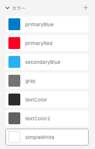

# SwiftColorConverter
XDのプラグイン。XD上で設定されているカラーパレットのカラーコードをSwiftとXCAssetsに変化させます。

## 使用方法
1. レポジトリを`/Users/ユーザー名/Library/Application Support/Adobe/Adobe XD/develop`下にクローンします。
2. 色を取得したいオブジェクトを選択し、XDのメニューから、`プラグイン/開発版/プラグインを再度読み込み`を選択  

3. XDの、メニューから`SwiftColorConverter`を選択  

4. 指定した場所に、`UIColor+extension.Swift`という名のファイルと`Colors.xcassets`というディレクトリが生成されます。

## 注意点
- 指定した場所に、`Colors.xcassets`はすでに存在している場合には、生成されないので削除してから実行してください。
- カラーパレットには以下のように色をセットしておくと良いでしょう。  
